# 💬 ChatApp - Ứng dụng Chat Realtime tích hợp AI & Lịch hợp

> Tài liệu kỹ thuật toàn diện của dự án ChatApp – bao gồm kiến trúc, luồng dữ liệu, mô hình CSDL, API và hướng dẫn vận hành.

---

## 📑 Mục lục

1. [Giới thiệu dự án](#1-giới-thiệu-dự-án)
2. [Kiến trúc tổng thể](#2-kiến-trúc-tổng-thể)
3. [Công nghệ sử dụng](#3-công-nghệ-sử-dụng)
4. [Cấu trúc thư mục](#4-cấu-trúc-thư-mục)
5. [Module Backend (Spring Boot)](#5-module-backend-spring-boot)
6. [Module AI Service (Flask)](#6-module-ai-service-flask)
7. [Module Frontend (React + Vite)](#7-module-frontend-react--vite)
8. [Các luồng nghiệp vụ chính](#8-các-luồng-nghiệp-vụ-chính)
9. [Mô hình dữ liệu](#9-mô-hình-dữ-liệu)
10. [Bảo mật và xác thực](#10-bảo-mật-và-xác-thực)
11. [Hướng dẫn cài đặt và chạy](#11-hướng-dẫn-cài-đặt-và-chạy)
12. [Kiểm thử nhanh](#12-kiểm-thử-nhanh)
13. [Xử lý sự cố thường gặp](#13-xử-lý-sự-cố-thường-gặp)
14. [Hướng phát triển tiếp theo](#14-hướng-phát-triển-tiếp-theo)

---

## 1. Giới thiệu dự án

**ChatApp** là một ứng dụng chat realtime hoàn chỉnh với các tính năng chính:

| Nhóm tính năng | Chi tiết |
|---|---|
| 👤 **Tài khoản** | Đăng ký, đăng nhập (JWT cookie), cập nhật hồ sơ, upload avatar (Cloudinary) |
| 🔍 **Mạng xã hội** | Tìm kiếm user, gửi/chấp nhận lời mời kết bạn, xem danh sách bạn bè |
| 💬 **Chat** | Chat 1–1, tạo group chat, gửi/nhận tin nhắn realtime qua WebSocket/STOMP |
| 🤖 **AI gợi ý** | Phân tích đoạn hội thoại → đề xuất 3 câu trả lời nhanh theo ngữ cảnh |
| 📅 **Lịch hợp AI** | Tạo lịch họp/sự kiện qua form trong khung chat, kết nối Google Calendar, thông báo tự động |

Dự án gồm **3 microservice** chạy độc lập, giao tiếp với nhau qua REST + WebSocket:

- **`fontend/my-chat-app`** – Frontend React + Vite (port `5173`)
- **`backend/chatapp`** – Backend Spring Boot (port `8080`)
- **`AIService`** – Microservice Python Flask (port `5000`)

---

## 2. Kiến trúc tổng thể

### 2.1. Sơ đồ kiến trúc cấp cao

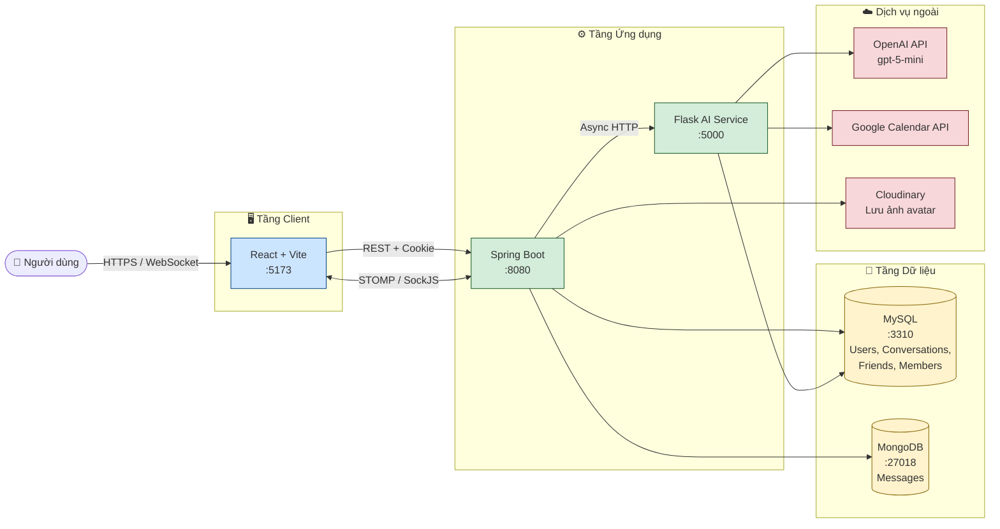

### 2.2. Sơ đồ triển khai (Deployment)

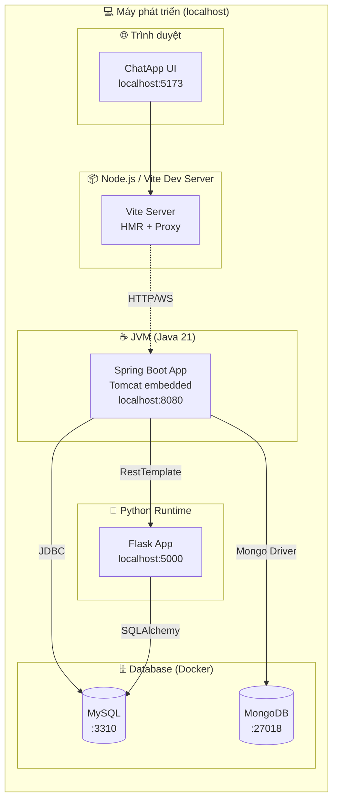

### 2.3. Nguyên tắc thiết kế

| Nguyên tắc | Áp dụng |
|---|---|
| **Tách microservice** | AI service viết riêng bằng Python để dễ tích hợp OpenAI / LangChain |
| **Realtime hai chiều** | Dùng STOMP trên WebSocket để push tin nhắn, gợi ý, thông báo lịch |
| **Bất đồng bộ AI** | Backend gọi AI qua `@Async` để không làm chậm request gửi tin nhắn |
| **Lưu trữ tách biệt** | MySQL cho dữ liệu quan hệ (user, friend), MongoDB cho document message |
| **Stateless JWT** | Spring Security STATELESS, token đặt trong HTTP-only cookie |

---

## 3. Công nghệ sử dụng

### 3.1. Frontend

| Thư viện | Phiên bản | Vai trò |
|---|---|---|
| React | 18.x | UI framework |
| Vite | 7.3 | Bundler / dev server |
| React Router | 7.13 | Định tuyến |
| Axios | 1.13 | HTTP client (gọi REST) |
| SockJS-client | 1.6 | Fallback WebSocket |
| @stomp/stompjs | 7.3 | STOMP client |
| Bootstrap | 5.3 | UI components |
| MDB React | 10.0 | Material design |
| Sass | 1.97 | CSS pre-processor |

### 3.2. Backend

| Thư viện | Phiên bản | Vai trò |
|---|---|---|
| Java | 21 | Ngôn ngữ |
| Spring Boot | 4.x | Framework chính |
| Spring Web MVC | – | REST controller |
| Spring Security | – | JWT filter, CORS |
| Spring Data JPA | – | ORM cho MySQL |
| Spring Data MongoDB | – | Driver cho MongoDB |
| Spring WebSocket | – | STOMP broker |
| MySQL Connector | – | Driver MySQL |
| JJWT | – | Tạo và parse JWT |
| Cloudinary SDK | – | Upload ảnh |

### 3.3. AI Service

| Thư viện | Vai trò |
|---|---|
| Flask | Web framework |
| OpenAI Python SDK | Gọi Responses API (`gpt-5-mini`) |
| SQLAlchemy + PyMySQL | Lưu kết quả phân tích lịch vào MySQL |
| google-api-python-client | Google Calendar API |
| google-auth-oauthlib | OAuth2 cho Google |
| python-dotenv | Đọc biến môi trường |

---

## 4. Cấu trúc thư mục

```text
ChatApp/
├── 📁 AIService/                        # Microservice Python Flask
│   ├── main.py                          # Entry point Flask, các endpoint /ai/*
│   ├── credentials.json                 # Google OAuth credentials (không commit)
│   ├── token.json                       # Google OAuth token cache
│   ├── .env                             # Biến môi trường (OPENAI_API_KEY, …)
│   ├── 📁 Models/
│   │   ├── AI.py                        # Wrapper OpenAI Responses API + cache LRU
│   │   ├── Database.py                  # Cấu hình SQLAlchemy (MySQL)
│   │   ├── db.py                        # SQLAlchemy instance
│   │   └── MeetingRaw.py                # Model bảng meetings_raw
│   └── 📁 Services/
│       ├── AIAgentsService.py           # Sinh gợi ý tin nhắn
│       ├── CalendarAnalyzer.py          # Phân tích form → JSON lịch họp
│       ├── CalendarTool.py              # Wrapper gọi CreateMeeting
│       ├── CreateMeeting.py             # Tạo event + Meet link qua Google API
│       └── CalendarNotification.py      # Sinh chuỗi nhắc lịch từ DB
│
├── 📁 backend/chatapp/                  # Spring Boot project
│   ├── pom.xml
│   ├── image.yaml / mongo.yaml          # Manifest Docker/K8s cho DB
│   └── src/main/
│       ├── java/com/example/chatapp/
│       │   ├── ChatappApplication.java  # Main class
│       │   ├── 📁 controller/           # REST + WebSocket controller
│       │   ├── 📁 services/             # Business logic
│       │   ├── 📁 entity/               # JPA entity (MySQL)
│       │   ├── 📁 MongodbModel/         # Document (MongoDB)
│       │   ├── 📁 dto/                  # Request / Response payload
│       │   ├── 📁 jpa/respository/      # JpaRepository
│       │   ├── 📁 mongodb/respository/  # MongoRepository
│       │   ├── 📁 EnumType/             # Các enum
│       │   ├── 📁 config/               # WebConfig, SecurityConfig, Async, CORS
│       │   ├── 📁 security/             # JWT filter + utils
│       │   ├── 📁 exception/            # Exception handler
│       │   └── 📁 Properties/           # Cloudinary properties
│       └── resources/
│           └── application.yaml         # Cấu hình DB, server port…
│
└── 📁 fontend/my-chat-app/              # React + Vite
    ├── package.json
    ├── vite.config.js
    └── src/
        ├── App.jsx                      # Định nghĩa route
        ├── main.jsx                     # Entry, BrowserRouter, providers
        ├── 📁 pages/                    # LoginPage, ChatDashboard
        ├── 📁 features/                 # Các tính năng (ChatDashboard, GroupChat, …)
        ├── 📁 services/                 # WebSocket, các file *.api.jsx (axios)
        ├── 📁 hooks/                    # useChat, useInputState
        ├── 📁 component/                # Button, Spinner, Toast
        └── 📁 styles/
```

---

## 5. Module Backend (Spring Boot)

### 5.1. Sơ đồ phân lớp

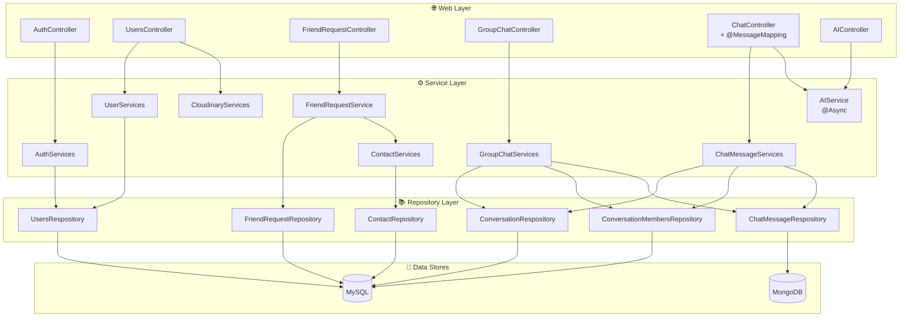

### 5.2. Danh sách API REST

#### Auth (`/auth`) – công khai

| Method | Endpoint | Mô tả | Body |
|---|---|---|---|
| `POST` | `/auth/login` | Đăng nhập, trả JWT trong cookie `access_cookie` | `{email, userpassword}` |
| `POST` | `/auth/logout` | Xoá cookie | – |

#### User (`/user`)

| Method | Endpoint | Mô tả |
|---|---|---|
| `POST` | `/user/create_user` | Tạo tài khoản mới (công khai) |
| `GET` | `/user/getAllUser` | Lấy toàn bộ user |
| `GET` | `/user/find_user?keyword=` | Tìm user theo từ khoá (loại trừ chính mình) |
| `GET` | `/user/get_userinfo` | Lấy thông tin user đang đăng nhập |
| `GET` | `/user/find_all_friends` | Danh sách bạn đã `ACCEPTED` |
| `POST` | `/user/update_user` | Cập nhật hồ sơ + upload avatar (form-data) |

#### Friend Request (`/api`)

| Method | Endpoint | Mô tả |
|---|---|---|
| `POST` | `/api/friend_request` | Gửi lời mời kết bạn |
| `GET` | `/api/find_request` | Lấy danh sách lời mời đang chờ |
| `POST` | `/api/status` | Chấp nhận / từ chối lời mời |

#### Group Chat (`/api/group`)

| Method | Endpoint | Mô tả |
|---|---|---|
| `POST` | `/api/group/create_group` | Tạo nhóm chat |
| `GET` | `/api/group/get_group` | Lấy nhóm chat của user |
| `GET` | `/api/group/get_messages?conversationId=` | Lấy message của nhóm |

#### Chat (không prefix)

| Method | Endpoint | Mô tả |
|---|---|---|
| `POST` | `/get_messages` | Mở/khởi tạo conversation 1–1 và lấy message + kích hoạt AI gợi ý |
| `GET` | `/get_conversation` | Lấy danh sách conversation |
| `GET` | `/test_cookie` | Debug – kiểm tra JWT cookie |

#### AI (`/api/ai`)

| Method | Endpoint | Mô tả |
|---|---|---|
| `POST` | `/api/ai/calendar` | Submit form scheduler → AI Service xử lý |
| `GET` | `/api/ai/get_calendar_notifications?conversationId=` | Lấy thông báo lịch họp |

### 5.3. WebSocket / STOMP

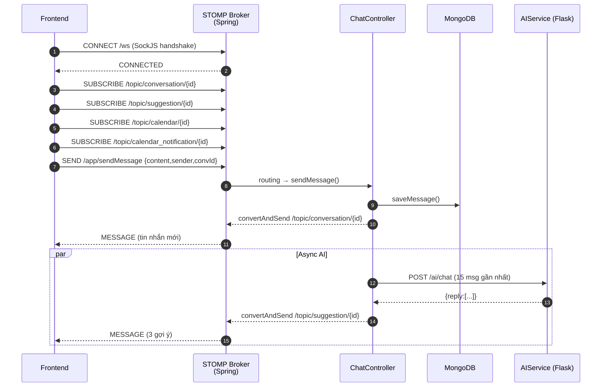

**Cấu hình `WebConfig`:**

- STOMP endpoint: `/ws` (SockJS fallback bật, `setAllowedOriginPatterns("*")`)
- Application prefix: `/app`
- Topic prefix: `/topic`

### 5.4. Cấu hình bất đồng bộ (`AsyncConfig`)

| Thuộc tính | Giá trị |
|---|---|
| Core pool size | 2 |
| Max pool size | 4 |
| Queue capacity | 100 |
| Thread name prefix | `ai-executor-` |

→ Đảm bảo việc gọi AI không khoá thread xử lý chat chính.

---

## 6. Module AI Service (Flask)

### 6.1. Sơ đồ thành phần

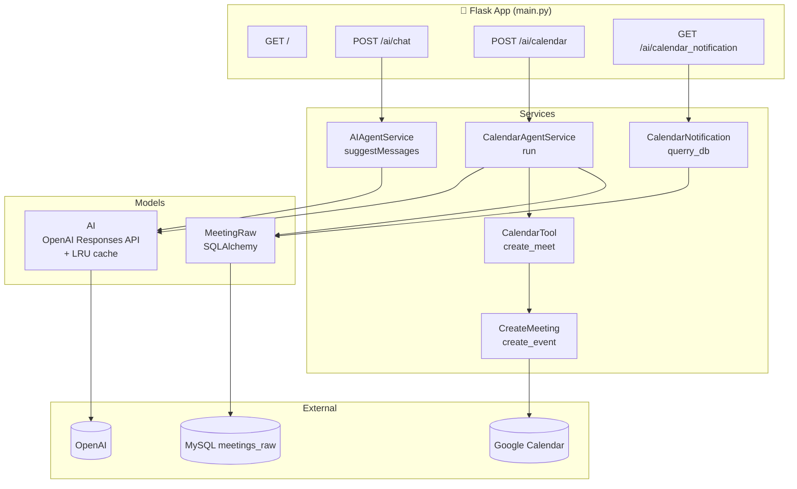

### 6.2. Endpoint chi tiết

#### `GET /`
Health-check:
```json
{ "service": "AI message suggestion", "status": "running" }
```

#### `POST /ai/chat`
Sinh gợi ý trả lời dựa trên ngữ cảnh.

**Request** – mảng JSON các message gần nhất:
```json
[
  { "content": "Hôm nay bạn thế nào?" },
  { "content": "Tôi khá mệt" }
]
```

**Response:**
```json
{
  "reply": [
    "Nghỉ ngơi một chút nhé!",
    "Có chuyện gì khiến bạn mệt vậy?",
    "Mình hiểu, cố lên nha 💪"
  ]
}
```

**Quy trình:**
1. Lấy tối đa **6 message** gần nhất, mỗi message tối đa **700 ký tự**.
2. Build prompt tiếng Việt yêu cầu OpenAI sinh đúng `count=3` câu, tone `friendly`.
3. `AI.generate()` gọi `client.responses.create()` (`gpt-5-mini`) với `temperature=1`, `max_tokens=max(320, count*120)`.
4. Cache LRU theo `(prompt, model, max_tokens, temperature, effort)`.
5. Tự retry với `max_tokens × 2` nếu reasoning model trả về incomplete.
6. Hậu xử lý: tách dòng, bỏ bullet/đánh số, cắt còn `count` câu.

#### `POST /ai/calendar`
Phân tích nội dung từ form scheduler.

**Request:**
```json
{ "message": "Họp dự án Synchat ngày 12/06 lúc 14:00 với nien@gmail.com" }
```

**Response (thành công):**
```json
{
  "reply": {
    "status": "ok",
    "meeting": {
      "title": "Họp dự án Synchat",
      "start_time": "2026-06-12T14:00:00+07:00",
      "end_time":   "2026-06-12T15:00:00+07:00",
      "attendees": ["nien@gmail.com"]
    },
    "meet_link": "https://meet.google.com/abc-defg-hij"
  }
}
```

**Response (thiếu thông tin):**
```json
{
  "reply": {
    "status": "needs_clarification",
    "next_question": "Bạn có thể cho mình biết giờ kết thúc cuộc họp không?"
  }
}
```

#### `GET /ai/calendar_notification`
Lấy 5 cuộc họp mới nhất và build chuỗi nhắc lịch.

**Response:**
```json
{
  "reply": {
    "message": "Nhắc lịch: Họp dự án Synchat. Bắt đầu: 14:00 12/06/2026. Kết thúc: 15:00 12/06/2026. Link họp: https://meet.google.com/...",
    "latest_meeting": { "id": 42, "data": { /* … */ }, "created_at": "…" }
  }
}
```

### 6.3. Luồng xử lý lịch họp

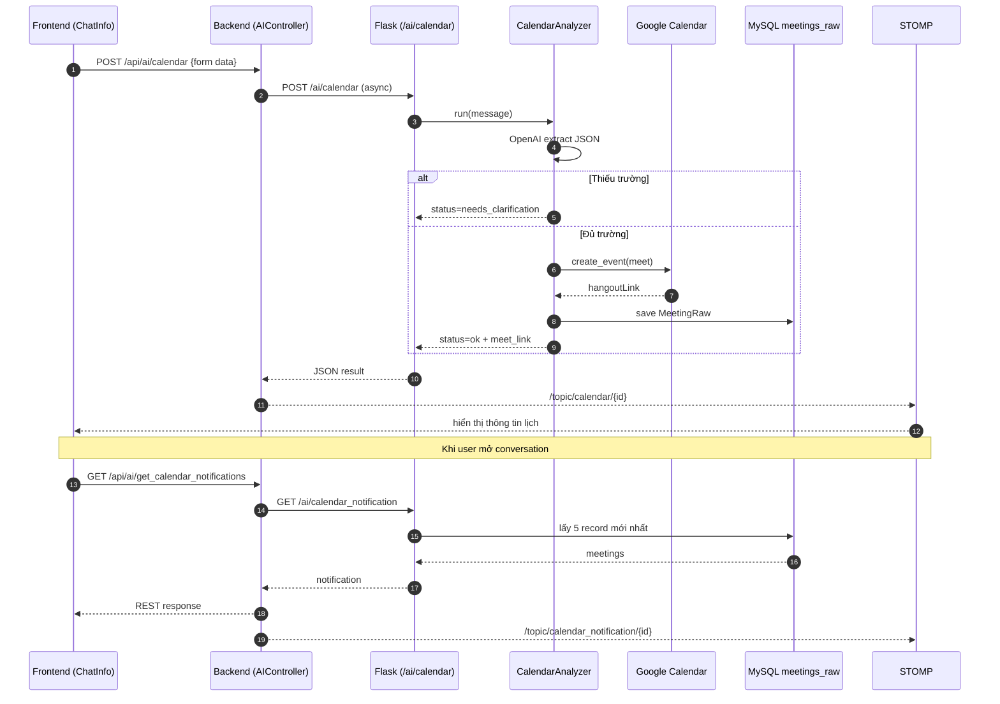

### 6.4. Biến môi trường (`AIService/.env`)

```env
OPENAI_API_KEY=sk-xxxx
OPENAI_MODEL=gpt-5-mini
AI_TIMEOUT=60
AI_CACHE_SIZE=100
AI_MAX_TOKENS=512
AI_RETRY_MAX_TOKENS=1024
AI_REASONING_EFFORT=low
```

Nếu muốn tạo Google Meet thật → cần `credentials.json` và `token.json` (OAuth2, scope `https://www.googleapis.com/auth/calendar`).

---

## 7. Module Frontend (React + Vite)

### 7.1. Cây component

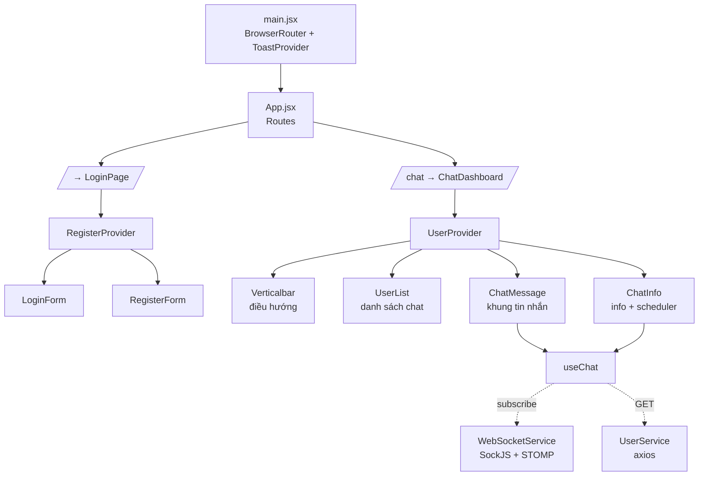

### 7.2. Cấu hình route

| Đường dẫn | Component | Mô tả |
|---|---|---|
| `/` | `LoginPage` | Trang đăng nhập / đăng ký |
| `/chat` | `ChatDashboard` | Màn hình chính sau khi đăng nhập |

### 7.3. Các thư mục feature

| Thư mục | Vai trò |
|---|---|
| `features/LoginPage/` | `LoginForm`, `RegisterForm` |
| `features/ChatDashboard/` | `ChatMessage`, `ChatInfo`, `UserList`, `Verticalbar`, `GroupCard`, `UsersCard` |
| `features/GroupChat/` | `AddMembers`, `FriendsList` (tạo nhóm) |
| `features/FriendRequest/` | `RequestList`, `RequestNotification` |
| `features/Contact/` | `Contact`, `UserList` (kết bạn) |
| `features/UserProfile/` | `UpdateUserForm` |
| `features/ViewProfile/` | `ViewProfile` |
| `features/Logout/` | `Setting` |

### 7.4. Hook `useChat` quản lý realtime

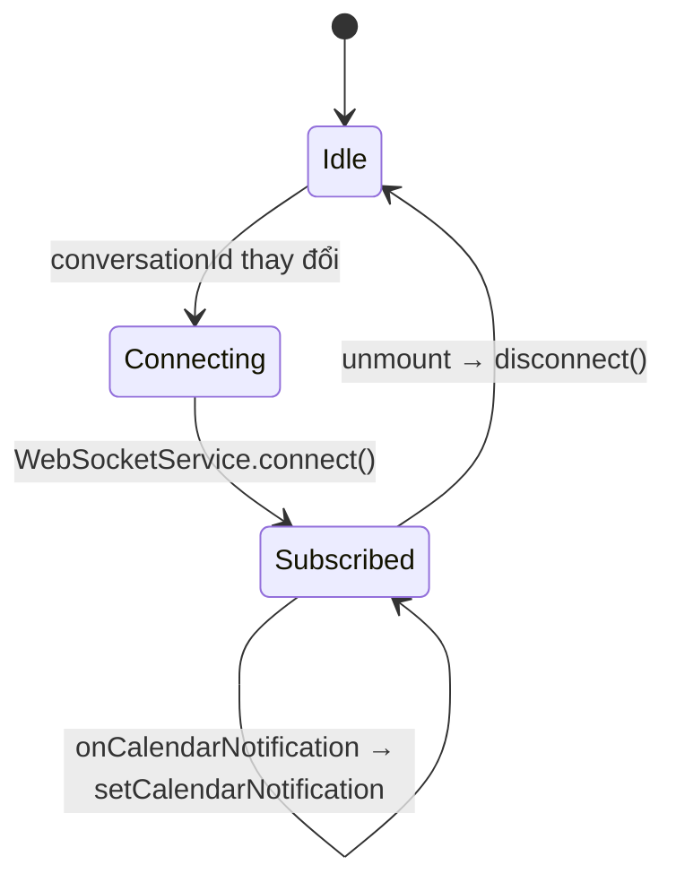

`useChat(conversationId)` trả về:
```js
{ message, suggestions, calendar, calendarNotification, sendMessage, handleCreateCalendar }
```

### 7.5. Các API helper (axios) tại `services/UserService/`

| File | Endpoint |
|---|---|
| `SearchUser.api.jsx` | `GET /user/find_user` |
| `getUserInformation.jsx` | `GET /user/get_userinfo` |
| `FindAllFriends.api.jsx` | `GET /user/find_all_friends` |
| `UpdateUser.api.jsx` | `POST /user/update_user` |
| `PrivateConversation.api.jsx` | `POST /get_messages` |
| `FriendRequest.api.jsx` | `POST /api/friend_request` |
| `FindReuqest.api.jsx` | `GET /api/find_request` |
| `SetStatus.api.jsx` | `POST /api/status` |
| `CreateGroup.api.jsx` | `POST /api/group/create_group` |
| `GetAllGroupChat.api.jsx` | `GET /api/group/get_group` |
| `getGroupMessages.api.jsx` | `GET /api/group/get_messages` |
| `CreateCalendar.api.jsx` | `POST /api/ai/calendar` |
| `GetCalendarNotification.jsx` | `GET /api/ai/get_calendar_notifications` |
| `Logout.api.jsx` | `POST /auth/logout` |

→ Tất cả gọi qua `httpClient.js` (axios instance, `baseURL = http://localhost:8080`, `withCredentials: true`).

### 7.6. WebSocketService (singleton)

| Topic / Destination | Hướng | Mục đích |
|---|---|---|
| `SEND /app/sendMessage` | FE → BE | Gửi tin nhắn |
| `SUB /topic/conversation/{id}` | BE → FE | Nhận tin nhắn realtime |
| `SUB /topic/suggestion/{id}` | BE → FE | Nhận 3 gợi ý AI |
| `SUB /topic/calendar/{id}` | BE → FE | Nhận kết quả tạo lịch |
| `SUB /topic/calendar_notification/{id}` | BE → FE | Nhận nhắc lịch |

Auto-reconnect sau **5 giây** nếu mất kết nối.

---

## 8. Các luồng nghiệp vụ chính

### 8.1. Đăng ký & đăng nhập

```mermaid
sequenceDiagram
    autonumber
    participant U as Người dùng
    participant FE as Frontend
    participant BE as Backend
    participant DB as MySQL

    U->>FE: Điền email + password
    FE->>BE: POST /user/create_user
    BE->>DB: INSERT users (password đã BCrypt)
    DB-->>BE: ok
    BE-->>FE: 200

    U->>FE: Nhấn Đăng nhập
    FE->>BE: POST /auth/login {email, userpassword}
    BE->>DB: tìm user, so sánh BCrypt
    DB-->>BE: user
    BE->>BE: jwtUtils.generateToken (HS512, 10h)
    BE-->>FE: Set-Cookie: access_cookie=<JWT>; HttpOnly
    FE->>FE: navigate('/chat')
```

### 8.2. Kết bạn

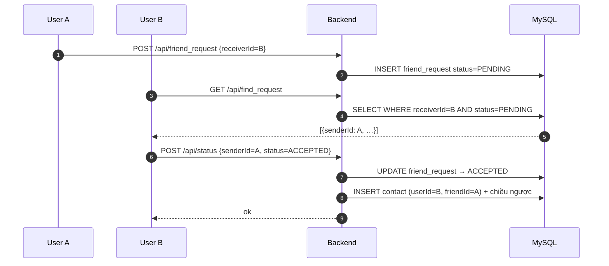

### 8.3. Gửi tin nhắn + nhận gợi ý AI

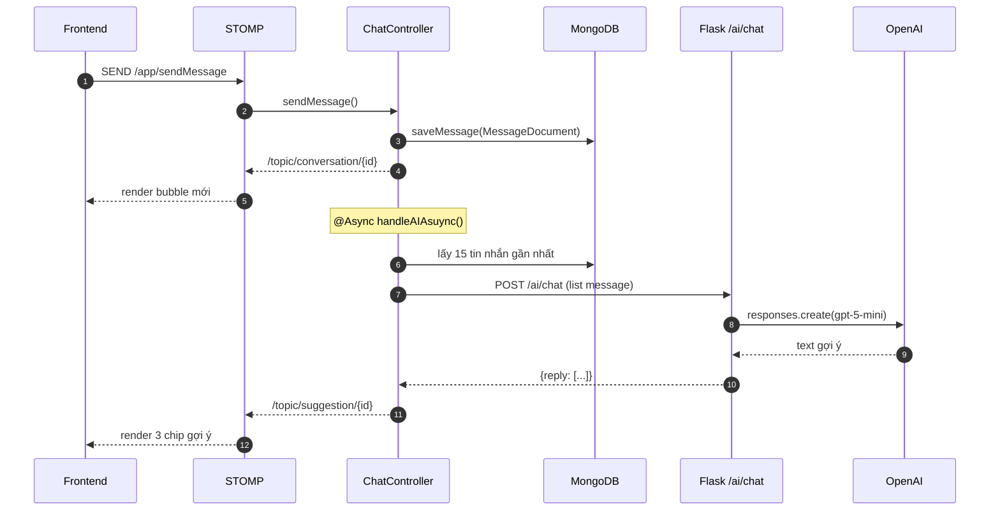

### 8.4. Tạo lịch họp bằng AI

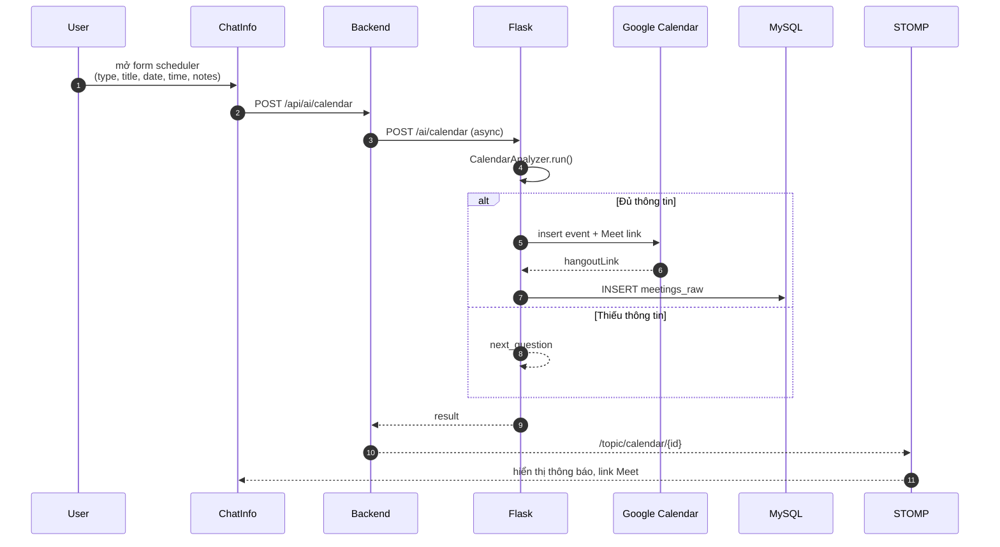

---

## 9. Mô hình dữ liệu

### 9.1. ERD – MySQL (`chatapp_database`)

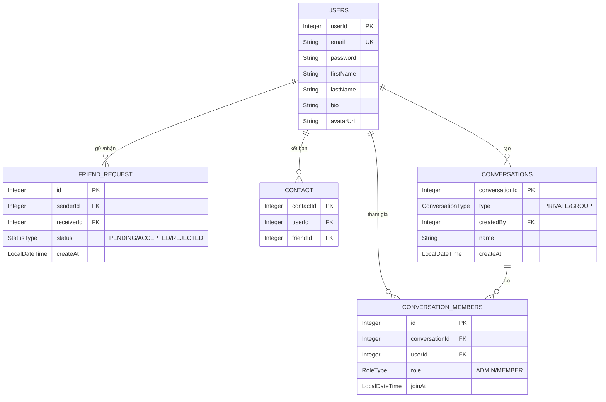

### 9.2. Schema – MongoDB (`messages`)

```javascript
{
  _id: ObjectId,
  conversationId: Integer,    // tham chiếu sang MySQL
  sender: String,             // userId dạng chuỗi
  content: String,
  timestamp: LocalDateTime    // tự gán khi save
}
```

### 9.3. Schema – Bảng `meetings_raw` của AI Service

| Cột | Kiểu | Mô tả |
|---|---|---|
| `id` | Integer PK | Tự tăng |
| `data` | JSON | Toàn bộ payload meeting AI sinh ra |
| `created_at` | DateTime | Auto-timestamp |

### 9.4. Enum

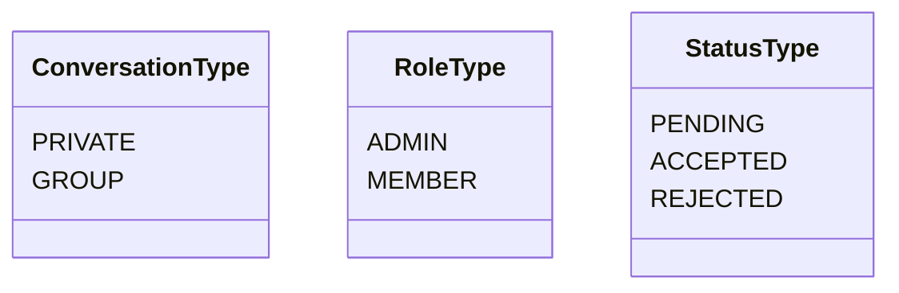

---

## 10. Bảo mật và xác thực

### 10.1. Luồng JWT

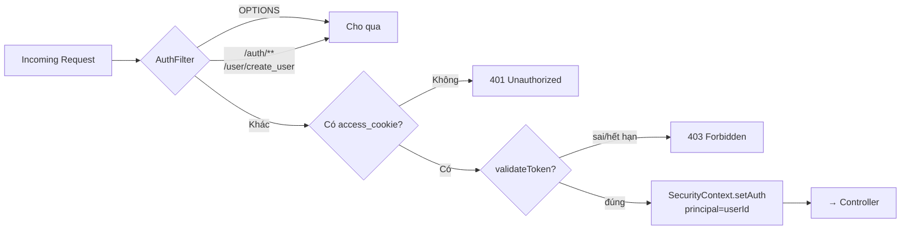

### 10.2. Cấu hình `SecurityConfig`

| Mục | Giá trị |
|---|---|
| CSRF | Disabled |
| Session | STATELESS |
| Public endpoint | `/auth/**`, `/user/create_user/**` |
| Form login | Disabled |
| HTTP Basic | Disabled |
| Filter chain | `AuthFilter` đặt trước `UsernamePasswordAuthenticationFilter` |
| Logout | Xoá cookie `access_cookie` |

### 10.3. CORS

| Mục | Giá trị |
|---|---|
| Origin cho phép | `http://localhost:5173` |
| Method | GET, POST, PUT, DELETE, OPTIONS |
| Header | `*` |
| Credentials | `true` |

### 10.4. JWT Utils

| Method | Mô tả |
|---|---|
| `generateToken(Users)` | HS512, hạn 10h, claim `userId` |
| `extractUser(token)` | Lấy `userId` từ claims |
| `validateToken(token)` | Verify signature + expiration |
| `getAuthentication(token)` | Trả `UsernamePasswordAuthenticationToken` |

### 10.5. Khuyến nghị bảo mật

- ⚠️ **Hard-code credential** (DB, Cloudinary) đang nằm trong `application.yaml` → cần đẩy ra `.env`.
- ⚠️ Cookie hiện đang `httpOnly(false)` để FE đọc được – nên đổi `true` nếu không thật sự cần.
- ⚠️ Bật **HTTPS**, **Secure cookie**, **SameSite** khi triển khai production.
- ⚠️ Tách config theo môi trường `dev / staging / prod`.

---

## 11. Hướng dẫn cài đặt và chạy

### 11.1. Yêu cầu môi trường

| Thành phần | Phiên bản tối thiểu |
|---|---|
| Node.js | 18+ |
| npm | mới nhất |
| Java JDK | 21 |
| Maven | có thể dùng wrapper `mvnw` |
| Python | 3.10+ |
| MySQL | 8.x (port `3310`) |
| MongoDB | 6.x (port `27018`) |
| Docker (tuỳ chọn) | mới nhất |

### 11.2. Thứ tự khởi động

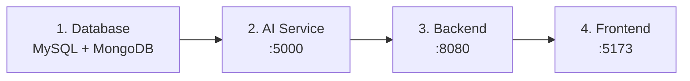

### 11.3. Bước 1 – Database

Nếu dùng Docker, tham khảo `backend/chatapp/image.yaml` và `backend/chatapp/mongo.yaml`.
Nếu chạy tay, hãy tạo:

- **MySQL** ở port `3310` với user `admin / 1234`, database `chatapp_database`
- **MongoDB** ở port `27018` với user `admin / 1234`, database `chatapp_database`

Hibernate đang ở chế độ `validate` nên cần khởi tạo schema sẵn (chạy backend lần đầu bằng `update` để tự tạo).

### 11.4. Bước 2 – AI Service

```bash
cd AIService
python3 -m venv .venv
source .venv/bin/activate
pip install flask openai sqlalchemy pymysql \
            google-api-python-client google-auth-httplib2 google-auth-oauthlib \
            python-dotenv
python3 main.py
```

→ Mặc định chạy ở `http://localhost:5000`.

**Test nhanh:**
```bash
curl http://localhost:5000/

curl -X POST http://localhost:5000/ai/chat \
  -H "Content-Type: application/json" \
  -d '[{"content":"Hôm nay bạn thế nào?"},{"content":"Tôi khá mệt"}]'
```

### 11.5. Bước 3 – Backend Spring Boot

```bash
cd backend/chatapp
./mvnw spring-boot:run         # Linux/Mac
mvnw.cmd spring-boot:run       # Windows
```

→ Mặc định chạy ở `http://localhost:8080`.

### 11.6. Bước 4 – Frontend

```bash
cd fontend/my-chat-app
npm install
npm run dev
```

→ Mặc định chạy ở `http://localhost:5173`.

**Build production:**
```bash
npm run build
```

### 11.7. Bảng tổng hợp lệnh

| Dịch vụ | Lệnh |
|---|---|
| 🤖 AI | `cd AIService && python3 main.py` |
| ⚙️ Backend | `cd backend/chatapp && ./mvnw spring-boot:run` |
| 🌐 Frontend | `cd fontend/my-chat-app && npm run dev` |

---

## 12. Kiểm thử nhanh

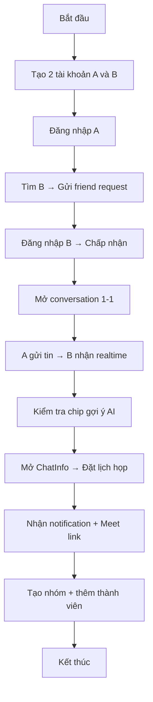

---

## 13. Xử lý sự cố thường gặp

| Triệu chứng | Nguyên nhân khả dĩ | Cách xử lý |
|---|---|---|
| FE không gọi được BE | CORS, backend chưa chạy, cookie chưa có | Kiểm tra `http://localhost:8080`, `withCredentials: true`, cookie `access_cookie` |
| WebSocket không nhận tin | `/ws` chưa bật, sai `conversationId` | Test `wscat` hoặc devtools, kiểm tra subscribe đúng topic |
| AI không trả gợi ý | Flask chưa chạy, `OPENAI_API_KEY` sai | `curl http://localhost:5000/`, kiểm tra `.env` |
| Tạo lịch lỗi | Thiếu `credentials.json` / `token.json`, scope sai | Chạy lại flow OAuth Google |
| Backend lỗi connect DB | Sai port / user / pass | Đối chiếu `application.yaml` với DB thực tế |
| Hibernate báo "Table not found" | DDL đang ở `validate` | Tạm đổi `ddl-auto: update` lần đầu rồi quay lại `validate` |
| Token hết hạn liên tục | Cookie hết 10h | Đăng nhập lại; có thể tăng thời hạn trong `jwtUtils` |

---

## 14. Hướng phát triển tiếp theo

- [ ] 📦 Đóng gói **Docker Compose** chạy full-stack bằng 1 lệnh.
- [ ] 🔐 Refactor secret → biến môi trường, tách config theo môi trường.
- [ ] 🧪 Bổ sung **unit test** + **integration test** cho cả 3 service.
- [ ] 📡 Mở rộng AI: ghi nhớ ngữ cảnh dài hạn, hỗ trợ stream phản hồi.
- [ ] 📅 Tích hợp đồng bộ 2 chiều với Google Calendar (webhook, push notification).
- [ ] 🔔 Thêm push notification (Web Push / FCM) cho tin nhắn, lời mời.
- [ ] 🖼️ Hỗ trợ gửi file/ảnh trong chat (đã có Cloudinary, cần mở rộng UI + endpoint).
- [ ] 📊 Bổ sung **observability**: log tập trung, trace ID xuyên 3 service, metric Prometheus.
- [ ] ♻️ Refactor naming endpoint & field cho thống nhất (`fontend → frontend`, `Reuqest → Request`, v.v.).
- [ ] 🌍 i18n: tách string cứng tiếng Việt sang resource bundle.

---

## 📌 Ghi chú

- Thư mục frontend đang là `fontend/my-chat-app` (gõ nhầm chính tả) – giữ nguyên để tránh phá link cũ.
- Một số ID claim trong JWT, field DB và tên file còn không nhất quán (`Reuqest`, `Respository`) – nên được chuẩn hoá khi mở rộng.
- Tài liệu này phản ánh source code hiện có trong repo tại thời điểm cập nhật.

---

<p align="center">
  <i>Made with ❤️ for the ChatApp project</i>
</p>